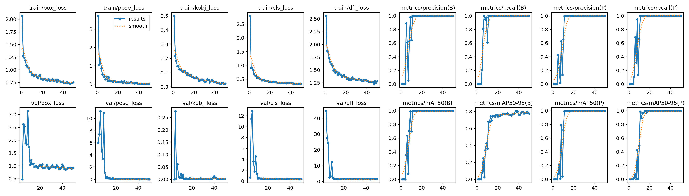

# Project Report for *2d-tennis*

As seen on the architecture, this project utilizes three different models. The first model is used for court corners detection, the second model is used for player detection, and the third model is used for tennis ball detection.

## 1. Court Detection

The data used in the court detection are YouTube videos from Australian Open which are split into frames. Australian Open had the highest quality, the most consistent camera angles and the most matches available. And it's one of my favorite tournaments as well :).
The code to do so is in the `dataset_creation.ipynb` file.

The most time consuming part was the annotation of the court corners. The annotation was done using `Roboflow`. The dataset consisted of 191 frames (after removing the frames with closeups etc).

Since the first models weren't performing well I added augmentations:
- Outputs per training example: 3
- Saturation: Between -25% and +25%
- Exposure: Between -10% and +10%

That grew the dataset to 459 images (402 train, 38 validation, 19 test).

The model is a *yolov8x* and was fine tuned using Google Collab and the code can be found in the `court_detection_training.ipynb`.

The reached accuracy was 0.997. You can see all the metrics and losses on the image below.

Finally, the model checkpoint is saved and downloaded for further use.

### Keypoint refining

Upon using the actual model on new images, I noticed model was not as accurate. It would get close to the corners, but not exactly, and when you calculate homography it would be off. I needed to further refine the keypoints.

I have tried many things, but what worked the best was to detect the main horisontal baselines by using the `cv2.HoughLinesP` function after the Canny transformation. I take a crop of a relative size around the predicted keypoints. Then I mask only the white pixels and find the most left and right points.

Example 1                  |  Example 2
:-------------------------:|:-------------------------:
 |   

Here you can see the red keypoints are the predicted ones, and the blue ones are the refined ones. The code with all these util functions is in the `court_keypoints.py` file in the utils folder.

## 2. Player Detection

Player detection was done using *yolov5s* model. I used it pretrained since it was performing well.

It is able to detect people very well. The problem is that there is a lot of people.

The issue arose about detecting the actual players. The model was detecting the audience, umpire and ball kids as well. 

I decided to detect only players by using geometry. I find the two closest people to the baselines at the start of the match and then track them throughout the match. The code for the util functions for detecting players is in the `players.py` and `geometry.py` files.

## 3. Ball Detection

Ball detection turned out to be the most difficult problem. I have tried using 4 different models:
- [DeepBall](https://github.com/RvI101/DeepBall-Keras)
- [WASB model](https://github.com/nttcom/WASB-SBDT/tree/main)
- [Tennis Tracking model](https://github.com/wendyminai/Tennis-Ball-Tracking-and-Detection/tree/main?tab=readme-ov-file)
- different YOLOs

None of them gave any good results. Maybe if I had more time I would've found a way to use them or trained my own model. For now the ball detection is an unsolved problem.

## 4. Building the whole pipeline?

I have put all the elements together in the `Model` class found in the `model.py` file. It has the `predict` method which takes an image and returns the detected elements. It firstly detects the court corners, calculates the homography, then detects the players and finally the ball. It projects the detected elements onto the virtual court and returns the location. It can be visualized:

Detected court              |  2D projection
:-------------------------:|:-------------------------:
 |   

If done on a video, it will return the frames which can be put together to make a video. I plan to try this for the demo.

The trackers are implemented but still not working as expected. For now they aren't used. 

## 5. Conclusion and possible improvements

The project was a great learning experience. I have learned a lot about object detection and tracking. I have also learned about homography and how to use it to transform the 3D court into a 2D plane.

The most time went to the court detection. My brother helped me with annotations since I had to redo it a few times. Model would be trained and the metrics seemed good, but when used on new images it would not perform as expected. 

The keypoint refining took a lot of time as well. I have tried many different approaches, but this one worked the best.

The biggest issue was the ball detection. Since the ball is so small and the video quality isn't the best it is very difficult. I would like to try to train my own model for this. I would also like to try to use the trackers to improve the player detection.

It is difficult for me to say how much effort went to which part since I was working on it throughout the semester in bursts of time. However, I can correct myself from the previous report:

- *3. Court Detection and Homography Calculation (5-7 days)* - took way more than that, in hourst probably around 30 hours
- *4. Player and Ball Detection using Pre-trained Models (4-5 days)* - also took much more time because of the ball detection problem. Player detection took less, around 10 hours but the ball detection took around 30 hours and still isn't solved.

What took less time than expected was the 2D projection and animation. Also, putting it all together after the models were trained was easier than expected.

I wish I had more time to work on this project since I see a lot of improvements that could be made. Maybe it was too big of a project for the time I had and for this course, but I am happy with the results I have achieved.